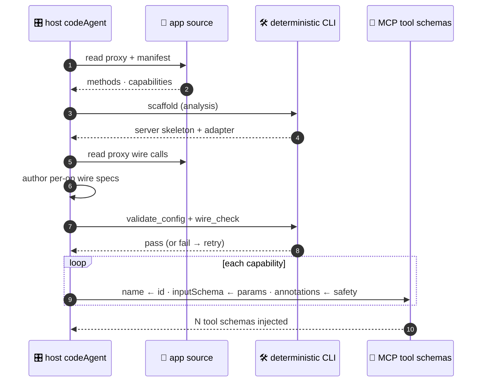
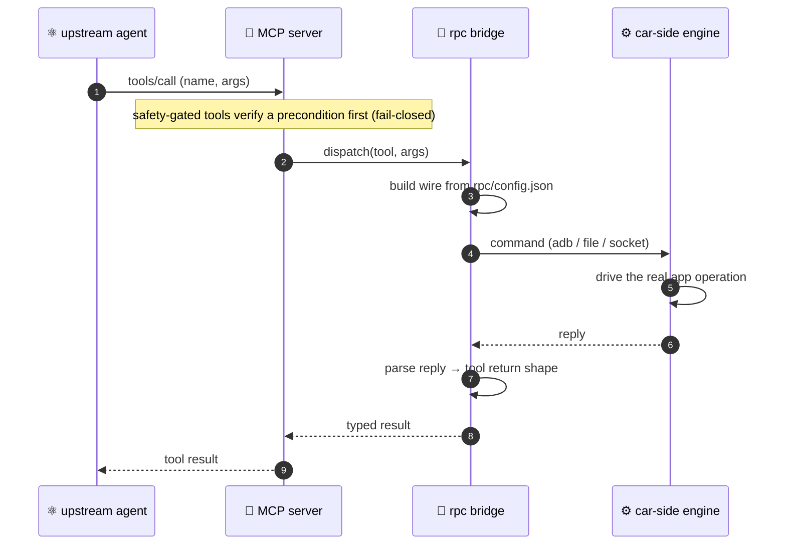

> **Visual Workbench:** launch it with `/mcp-pipeline [app-source-dir]` — a local Electron single-window app (no HTTP server, no browser) that drives the source-to-MCP pipeline. For development, `npm install` then `npm run workbench:dev`. See [docs/WORKBENCH.md](docs/WORKBENCH.md).

<div align="center">

# 🎛️ Code Agent Suite BRIDGE


**B**uilding **R**eal-device **I**nterfaces via **D**eterministic **G**ated **E**xecution

`analyze` › `curate` › `scaffold` › `generate` › `gates` › `build`


**English** · [简体中文](README.zh-CN.md)

</div>

---

**BRIDGE** (*Building Real-device Interfaces via Deterministic Gated Execution*): agent-driven **skills** carry the methodology, a **deterministic** Node CLI does the heavy lifting, and the host agent drives every step. **No model calls live inside the plugin** — the host agent supplies all judgment, and every generated artifact is byte-for-byte reproducible.

## 🧠 How it works

Given an app's source + manifest, BRIDGE emits an **MCP suite**: agent-facing function schemas, a runnable MCP Server, an RPC wire contract, car-side bridge artifacts, and verification evidence. The upstream agent can call those tools to **actually drive the device** — EQ, soundstage, Beosonic, karaoke, vehicle signals, … — not a throw-stub mock. The function schema surface is the primary artifact for upstream model understanding; the rest of the suite makes those tools executable and auditable.

The pipeline below lays out the stages; the figure after it shows who does what during generation.

**Pipeline** — every step is a deterministic CLI subcommand or an agent skill:

```
validate › analyze › [curate] › scaffold › generate › test › build › register › verify › schema_preview 🟢
  (CLI)     (skill)   (skill)    (CLI)    (skill+gates) (CLI)  (CLI)   (CLI)     (CLI)        (CLI)
```

Progress persists in `.mcp-pipeline/<app>/state.json` for resume — `--from`, `--only`, `--step`, `--batch`.

> The two gates (`validate_config` + `wire_check`) are inline sub-steps of `generate`, retried until both pass before the pipeline advances. `[curate]` is optional.

**The generation process.** Who does what: the host agent supplies judgment (extraction, wire authoring), the CLI is deterministic (scaffold, gates). Each capability is mapped to one tool definition — `name ← id`, `inputSchema ← params`, `annotations ← safety`.



**The runtime bridge.** Once built, a tool call flows from the upstream agent through the generated server and a deterministic bridge to the real device — the transport is swappable (`adb` / file / socket), and the wire is constructed purely from `rpc/config.json`, so the bridge carries zero app literals.



## 🖥️ Visualization

The whole pipeline is drivable from a **visual workbench** — a local Electron single-window desktop app (no HTTP server, no `localhost`, no browser tab). Launch it from inside Claude Code or Codex:

```
/mcp-pipeline ./path/to/your-app
```

That command runs `scripts/launch-workbench.mjs`, which builds the workbench packages on first launch (expect ~2–5 min) and opens the window. Give the launching command a generous timeout (≥ 600000 ms) so the first build can finish.

What you see (the UI is Chinese-labeled):

- **Import & analyze** — pick a source directory and an optional format-reference Schema, then click 「导入并自动分析」 to run `analyze` (and `curate`) end-to-end. Candidate capabilities are discovered **only** from source; the reference Schema guides output format, it never seeds capabilities.
- **Machine-readable artifacts** — the 「机器可读产物」 panel inspects the generated `analysis.json`, the selected capabilities, the full generated tool schema (under the 「工具」 tab), and discovery findings. Tabs: 「能力」 · 「工具」 · 「RPC」 · 「发现」.
- **MCP debug** — the 「MCP 调试」 panel runs the built MCP server in place: list tools, call them, and inspect replies, so you can verify behavior before handing the server to a host agent.
- **Traceability** — a 源码 → 能力 → MCP → RPC transformation map and a coverage dashboard (已发现 / 已选择 / 已投影 / 已接线) show, per capability, how source becomes a wired tool.

The workbench talks to the same deterministic CLI the skills use — nothing about the pipeline changes when you drive it visually. For development (hot rebuild of the UI / desktop / control-server packages), use `npm run workbench:dev` instead of the command. Workbench internals are in [docs/WORKBENCH.md](docs/WORKBENCH.md); the package layout is listed under [Architecture](#-architecture).

## 📦 Deliverables

A successful run should produce a reviewable delivery bundle, not just a generated folder:

| Audience | Deliverable | Location | Why it matters |
|---|---|---|---|
| **Upstream agent** | Function schema surface | `tools-schema.json` from `schema_preview`, and `src/tools/schema.ts` inside the generated server | The exact tool names, descriptions, input schemas, safety annotations, and executability flags injected into Claude / Codex. |
| **MCP host** | Runnable MCP Server | Generated server directory, `dist/index.js` after build, and `conf/config.yaml` | The stdio server that hosts the tools. |
| **App / device integrator** | RPC wire contract | `rpc/config.json`, `src/rpc/*`, and `car-side/` | The traceable bridge from each tool call to real app / device operations. |
| **Reviewer** | Verification evidence | `.mcp-pipeline/<app>/state.json`, `.mcp-pipeline/test-results.json`, gate output, build output, verify output | The audit trail showing schema validity, wire coverage, buildability, tool discovery, and tool-call responsiveness. |

Produce the upstream-agent schema directly from analysis plus optional wire status:

```bash
mcp-pipeline schema_preview <analysis.json> [<rpc/config.json>] --output tools-schema.json
```

`rpc/config.json` may mark intentionally unwired tools in `_deferred`; those appear as `executable:false` rather than silently pretending to work.

Done means:

1. `tools-schema.json` exposes every selected capability exactly once.
2. Every tool has a concrete description, concrete input schema, correct enum values, and safety annotations.
3. `validate`, `validate_config`, `wire_check`, `test`, `build`, and `verify` all pass.
4. `verify` proves business-tool calls, not only `health_check`.
5. `car-side/` can be handed to the device-side colleague without reverse-engineering the pipeline internals.

Full contract: [`docs/DELIVERABLE_CONTRACT.md`](docs/DELIVERABLE_CONTRACT.md).

## 🛡️ Why it's reliable

| Guarantee | How it's enforced |
|---|---|
| **Deterministic output** | Generators carry zero app literals — any app, any machine, byte-for-byte reproducible. |
| **Verified before build** | Two fail-closed gates — `validate_config` (schema + coverage + dispatchable) and `wire_check` (proxy wire-format match) — must pass on the host's only judgment product, `rpc/config.json`. |
| **Fail-closed safety** | `p_gear_required` tools are blocked unless Park is verified; degenerate input (empty / unmatched) errors instead of passing vacuously. |
| **Honest selection** | `--selection` with a missing file, unknown ids, or an empty list **errors loudly** rather than silently over- or under-generating. |
| **Real bridge, no network** | A car-side RPC engine (delivered to a colleague) bridges host → device over adb / file / sendlink. |
| **Self-contained** | CLI runs via a skill-base-relative path; `framework/` + `cli/` deps auto-install and build on first session. |

## 📥 Install & run

**Claude Code**

```bash
/plugin marketplace add https://github.com/MatCaviar/im-mcp-codeagent.git
/plugin install im-mcp-codeagent
```

First session start auto-installs `framework/` + `cli/` and builds `cli/dist` (idempotent). Then launch the visual workbench:

```
/mcp-pipeline ./path/to/your-app
```

`/mcp-pipeline` opens the visual workbench (see [Visualization](#-visualization)); pass an app source directory to pre-load it. Entry points — `/mcp-pipeline` · `/mcp-verify <dir>` · `/mcp-help`.

**Codex** reads the mirrored `.codex-plugin/plugin.json` (dual-end).

Typical run shape:

```bash
# deterministic checks / generation
mcp-pipeline validate <analysis.json>
mcp-pipeline scaffold <analysis.json> --output <server>

# host-agent judgment product + deterministic gates
mcp-pipeline validate_config <server>/rpc/config.json --analysis <analysis.json>
mcp-pipeline wire_check <server>/rpc/config.json --proxy <path/to/Proxy.ts>

# upstream-agent schema and runtime proof
mcp-pipeline schema_preview <analysis.json> <server>/rpc/config.json --output <server>/tools-schema.json
mcp-pipeline test --dir <server>
mcp-pipeline build --dir <server>
mcp-pipeline verify --dir <server>
```

Normal plugin users usually enter through `/mcp-pipeline`; the lower-level CLI commands are shown so the generated delivery bundle is auditable and reproducible.

## 🧩 Capability selection

Most apps expose far more capabilities than you want to MCP-ify. After install and initial `analyze`, **curate** lets you choose the subset — the user's pick is the first priority.

```bash
# 1. Enumerate candidates deterministically (writes nothing)
mcp-pipeline curate <analysis.json> [--prd <prd.md>]

# 2. /mcp-curate proposes a subset, you choose → writes selection.json
# 3. Scaffold generates only the chosen capabilities
mcp-pipeline scaffold <analysis.json> --output <dir> --selection .mcp-pipeline/<app>/selection.json
```

`selection.json = { "selected": ["<cap.id>", …] }`. Re-pick any time — the generate-layer regenerates, while `conf/config.yaml` and `rpc/config.json` are preserved.

## 🔄 Update (already installed)

When a new version ships, refresh and reload:

```text
/plugin marketplace update im-mcp-marketplace        # 1. refresh the catalog   (arg = marketplace name)
/plugin update im-mcp-codeagent@im-mcp-marketplace   # 2. pull the new version  (arg = plugin@marketplace)
/reload-plugins                                      # 3. activate it + re-run the build hook
```

> `/reload-plugins` (or a full `/exit` + relaunch) is **required** — until then the previous version stays live. The first session after reload re-runs the `SessionStart` build hook, which compiles `cli/dist` for the new version.

Verify the installed version:

```text
/plugin list
```

**Fallback** — if `/plugin update` reports "already latest" but the code didn't change (stale cache, or the version wasn't bumped):

```text
/plugin uninstall im-mcp-codeagent@im-mcp-marketplace
/plugin marketplace update im-mcp-marketplace
/plugin install im-mcp-codeagent@im-mcp-marketplace
/reload-plugins
```

## 📡 Real-device prerequisites

The generated server drives the car over an adb / file bridge. Before a real device responds:

1. **Colleague** builds + installs the car-side `RpcEngine.ts` and registers the `page://<app>/rpcagent` manifest page — both emitted under `car-side/`.
2. **`adb -host`** reachability to the device.
3. **ZebraAlfred** keep-alive (or equivalent) — otherwise the device sleeps and sendlink intermittently returns exit `-1`.

No device handy? Local verification always works: `mcp-pipeline verify --dir <server>` (install + tsc + tool responsiveness + bridge readiness).

## 🧱 Architecture

```
im-mcp-codeagent/
├── .claude-plugin/        Claude Code manifest + marketplace
├── .codex-plugin/         Codex manifest (dual-end mirror)
├── skills/                mcp-analyze · mcp-curate · mcp-generate · mcp-test  (methodology, no model calls)
├── commands/              /mcp-pipeline · /mcp-verify · /mcp-help
├── hooks/                 SessionStart → polyglot build (run-hook.cmd → session-init.sh)
├── cli/                   @im/mcp-pipeline-cli — deterministic Node
│   ├── src/generators/    tool-schema · rpc-bridge · car-rpc-engine · …
│   ├── assets/            car-rpc-engine.ts.template (bundled, de-hardcoded)
│   └── bin/mcp-pipeline.js
├── framework/             @im/mcp-server-framework (shared dispatch core: constructDbusCall / …)
├── workbench-contracts/   @bridge/workbench-contracts — shared TS types across the workbench packages
├── control-server/        @bridge/control-server — in-process pipeline + MCP runner (imported by desktop, no HTTP)
├── desktop/               @bridge/desktop — Electron main + preload (single window via loadFile, no HTTP server)
├── ui/                    @bridge/ui — React + Vite render layer (Chinese-labeled)
├── scripts/               launch-workbench.mjs · start-workbench.ps1 · smoke-*-workbench.mjs · check-manifests.js
├── assets/                bridge.svg + workbench artwork
├── docs/                  WORKBENCH.md · WORKBENCH-TROUBLESHOOTING.md · DELIVERABLE_CONTRACT.md
├── tools/adb/             bundled adb (self-contained; see LICENSE note)
└── schema/                analysis.schema.json + fixtures
```

The CLI runs via a **skill-base-relative path** (`${SKILL_DIR}/../../cli/bin/mcp-pipeline.js`) — self-contained, no PATH / global-link dependency.

## 🛠️ Develop

This section is for maintainers changing the plugin itself. Normal users running `/mcp-pipeline` do not need these commands.

```bash
cd framework && npm install
cd ../cli     && npm install && npx tsc     # build cli/dist (the real CLI loads dist/ — rebuild after source edits)
cd ../cli     && npx vitest run             # full suite
node scripts/check-manifests.js             # claude / codex manifest drift guard
```

## 📜 License

MIT — see [LICENSE](LICENSE). `tools/adb/` bundles Google's adb under its own terms.

<div align="center">
<sub>Code Agent Suite BRIDGE — built by Tongji University &amp; IM · controllable code generation for the cockpit</sub>
</div>
