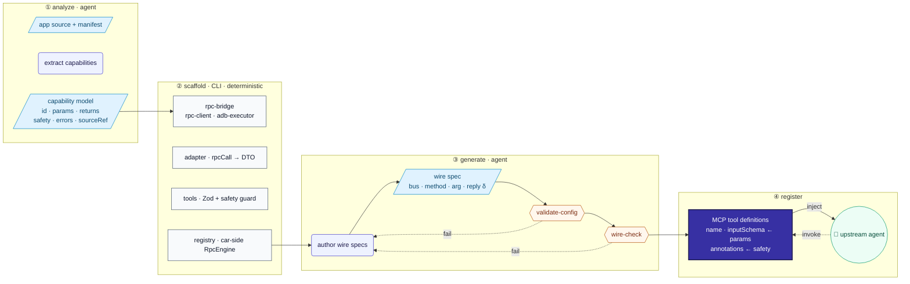
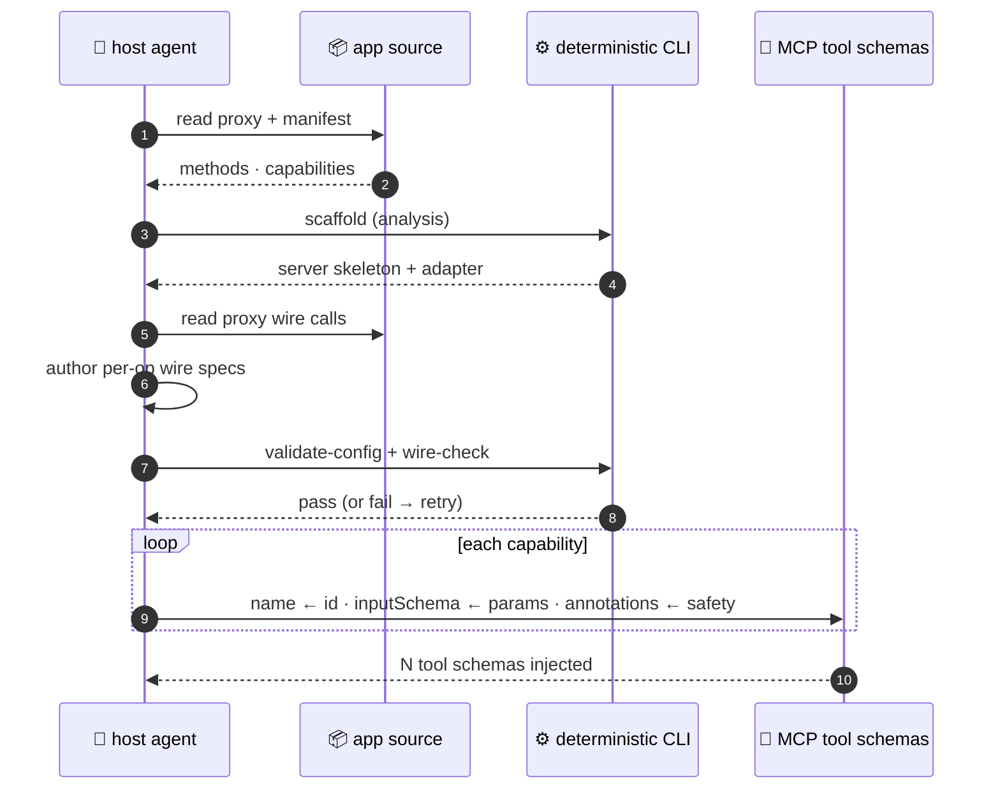

<div align="center">

# 🎛️ CodeAgent @ MCP


**B**uilding **R**eal-device **I**nterfaces via **D**eterministic **G**ated **E**xecution

`analyze` › `curate` › `scaffold` › `generate` › `gates` › `build`


</div>

---

A Claude Code / Codex plugin — **BRIDGE** (*Building Real-device Interfaces via Deterministic Gated Execution*): agent-driven **skills** carry the methodology, a **deterministic** Node CLI does the heavy lifting, and the host agent drives every step. **No model calls live inside the plugin** — the host agent supplies all judgment, and every generated artifact is byte-for-byte reproducible.

Given an app's source + manifest, it emits a ready-to-run MCP Server that an upstream agent can call to **actually drive the device** — EQ, soundstage, Beosonic, karaoke, vehicle signals, … — not a throw-stub mock.

## 🧠 How it works

The deliverable is a set of **MCP tool definitions** — the function schemas an upstream agent (Claude / Codex) is injected with and calls. The server that hosts them is secondary; the schema surface is the point. Two views of how an app becomes that surface.

**Fig. 1 — Anatomy of generation.** Four phases — analyze → scaffold → generate → register — each opened to its real components. The agent supplies judgment (extract, author wire specs); the CLI is deterministic (scaffold, gates). Two fail-closed gates retry on failure; the deliverable is the set of MCP tool definitions injected into the upstream agent.



**Fig. 2 — The generation process.** Who does what: the host agent supplies judgment (extraction, wire authoring), the CLI is deterministic (scaffold, gates). Each capability is mapped to one tool definition — `name ← id`, `inputSchema ← params`, `annotations ← safety`.



## 🛡️ Why it's reliable

| Guarantee | How it's enforced |
|---|---|
| **Deterministic output** | Generators carry zero app literals — any app, any machine, byte-for-byte reproducible. |
| **Verified before build** | Two fail-closed gates — `validate-config` (schema + coverage + dispatchable) and `wire-check` (proxy wire-format match) — must pass on the host's only judgment product, `rpc/config.json`. |
| **Fail-closed safety** | `p_gear_required` tools are blocked unless Park is verified; degenerate input (empty / unmatched) errors instead of passing vacuously. |
| **Honest selection** | `--selection` with a missing file, unknown ids, or an empty list **errors loudly** rather than silently over- or under-generating. |
| **Real bridge, no network** | A car-side RPC engine (delivered to a colleague) bridges host → device over adb / file / sendlink. |
| **Self-contained** | CLI runs via a skill-base-relative path; `framework/` + `cli/` deps auto-install and build on first session. |

## 🧭 Pipeline

```
validate › analyze › [curate] › scaffold › generate › test › build › register › verify 🟢
  (CLI)     (skill)   (skill)    (CLI)    (skill+gates) (CLI)  (CLI)   (CLI)     (CLI)
```

Each step is either a **deterministic CLI** subcommand or an **agent skill**. Progress persists in `.mcp-pipeline/<app>/state.json` for resume — `--from`, `--only`, `--step`, `--batch`.

> The two gates (`validate-config` + `wire-check`) are inline sub-steps of `generate`, retried until both pass before the pipeline advances. `[curate]` is optional.

## 🧩 Capability selection

Most apps expose far more capabilities than you want to MCP-ify. After `analyze`, **curate** lets you choose the subset — the user's pick is the first priority.

```bash
# 1. Enumerate candidates deterministically (writes nothing)
mcp-pipeline curate <analysis.json> [--prd <prd.md>]

# 2. /mcp-curate proposes a subset, you choose → writes selection.json
# 3. Scaffold generates only the chosen capabilities
mcp-pipeline scaffold <analysis.json> --output <dir> --selection .mcp-pipeline/<app>/selection.json
```

`selection.json = { "selected": ["<cap.id>", …] }`. Re-pick any time — the generate-layer regenerates, while `conf/config.yaml` and `rpc/config.json` are preserved.

## 📥 Install

**Claude Code**

```bash
/plugin marketplace add https://github.com/MatCaviar/im-mcp-codeagent.git
/plugin install im-mcp-codeagent
```

First session start auto-installs `framework/` + `cli/` and builds `cli/dist` (idempotent). Then:

```
/mcp-pipeline ./path/to/your-app
```

Entry points — `/mcp-pipeline` · `/mcp-verify <dir>` · `/mcp-help`.

**Codex** reads the mirrored `.codex-plugin/plugin.json` (dual-end).

## 🔄 Update (already installed)

When a new version ships, refresh and reload:

```text
/plugin marketplace update im-mcp-marketplace        # 1. refresh the catalog   (arg = marketplace name)
/plugin update im-mcp-codeagent@im-mcp-marketplace   # 2. pull the new version  (arg = plugin@marketplace)
/reload-plugins                                      # 3. activate it + re-run the build hook
```

> `/reload-plugins` (or a full `/exit` + relaunch) is **required** — until then the previous version stays live. The first session after reload re-runs the `SessionStart` build hook, which compiles `cli/dist` for the new version.

Verify the installed version:

```text
/plugin list
```

**Fallback** — if `/plugin update` reports "already latest" but the code didn't change (stale cache, or the version wasn't bumped):

```text
/plugin uninstall im-mcp-codeagent@im-mcp-marketplace
/plugin marketplace update im-mcp-marketplace
/plugin install im-mcp-codeagent@im-mcp-marketplace
/reload-plugins
```

## 📡 Real-device prerequisites

The generated server drives the car over an adb / file bridge. Before a real device responds:

1. **Colleague** builds + installs the car-side `RpcEngine.ts` and registers the `page://<app>.yunos.com/rpcagent` manifest page — both emitted under `car-side/`.
2. **`adb -host`** reachability to the YunOS device.
3. **ZebraAlfred** keep-alive (or equivalent) — otherwise the device sleeps and sendlink intermittently returns exit `-1`.

No device handy? Local verification always works: `mcp-pipeline verify --dir <server>` (install + tsc + tool responsiveness + bridge readiness). Real-device smoke: `scripts/smoke-real-device.sh`.

## 🧱 Architecture

```
im-mcp-codeagent/
├── .claude-plugin/       Claude Code manifest + marketplace
├── .codex-plugin/        Codex manifest (dual-end mirror)
├── skills/               mcp-analyze · mcp-curate · mcp-generate · mcp-pipeline · mcp-test  (methodology, no model calls)
├── commands/             /mcp-pipeline · /mcp-verify · /mcp-help
├── hooks/                SessionStart → polyglot build (run-hook.cmd → session-init.sh)
├── cli/                  @im/mcp-pipeline-cli — deterministic Node
│   ├── src/generators/   rpc-bridge · yunos-adapter-rpc · car-rpc-engine · …
│   ├── assets/           car-rpc-engine.ts.template (bundled, de-hardcoded)
│   └── bin/mcp-pipeline.js
├── framework/            @im/mcp-server-framework (shared dispatch core: constructDbusCall / …)
├── tools/adb/            bundled adb (self-contained; see LICENSE note)
└── schema/               analysis.schema.json + test fixture
```

The CLI runs via a **skill-base-relative path** (`${SKILL_DIR}/../../cli/bin/mcp-pipeline.js`) — self-contained, no PATH / global-link dependency.

## 🛠️ Develop

```bash
cd framework && npm install
cd ../cli     && npm install && npx tsc     # build cli/dist (the real CLI loads dist/ — rebuild after source edits)
cd ../cli     && npx vitest run             # full suite
node scripts/check-manifests.js             # claude / codex manifest drift guard
```

## 📜 License

MIT — see [LICENSE](LICENSE). `tools/adb/` bundles Google's adb under its own terms.

<div align="center">
<sub>CodeAgent @ MCP · BRIDGE — built by Tongji University &amp; IM · controllable MCP for the YunOS cockpit</sub>
</div>
