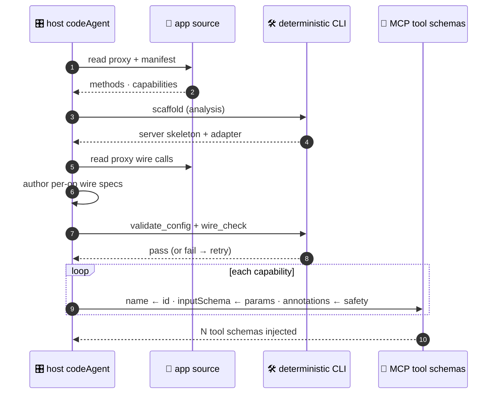
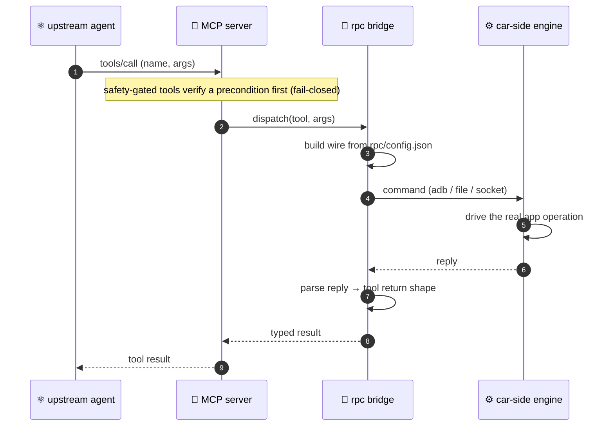

<div align="center">

# 🎛️ Code Agent Suite BRIDGE


**B**uilding **R**eal-device **I**nterfaces via **D**eterministic **G**ated **E**xecution

`bridge-analyze` › `validate-analysis` › `serve` › `invoke`


**English** · [简体中文](README.zh-CN.md)

</div>

---

**BRIDGE** (*Building Real-device Interfaces via Deterministic Gated Execution*): agent-driven **skills** carry the methodology, a **deterministic** Node CLI does the heavy lifting, and the host agent drives every step. **No model calls live inside the plugin** — the host agent supplies all judgment, and every generated artifact is byte-for-byte reproducible.

## 🧠 How it works

Given an app's source + manifest, BRIDGE emits an **MCP suite**: agent-facing function schemas, a runnable MCP Server, an RPC wire contract, car-side bridge artifacts, and verification evidence. The upstream agent can call those tools to **actually drive the device** — EQ, soundstage, Beosonic, karaoke, vehicle signals, … — not a throw-stub mock. The function schema surface is the primary artifact for upstream model understanding; the rest of the suite makes those tools executable and auditable.

The pipeline below lays out the stages; the figure after it shows who does what during generation.

**Pipeline** — every step is a deterministic CLI subcommand or an agent skill:

```
输入任意 app(源码/APK/PRD/行为观察) › bridge-analyze 产出 analysis.json › validate-analysis 校验 › serve 投影为 MCP 工具 › invoke 上车执行 🟢
  (CLI)     (skill)   (skill)    (CLI)    (skill+gates) (CLI)  (CLI)   (CLI)     (CLI)
```

Progress persists in `.mcp-pipeline/<app>/state.json` for resume — `--from`, `--only`, `--step`, `--batch`.

> The skill is executed autonomously by the host codeagent; validation is deterministic (`validate-analysis.mjs`). Registry (car-side dispatch table) is derived from the same analysis — one artifact, dual consumption (serve projection + on-car registry).

**The generation process.** Who does what: the host agent supplies judgment (extraction, wire authoring), the CLI is deterministic (scaffold, gates). Each capability is mapped to one tool definition — `name ← id`, `inputSchema ← params`, `annotations ← safety`.



**The runtime bridge.** Once built, a tool call flows from the upstream agent through the generated server and a deterministic bridge to the real device — the transport is swappable (`adb` / file / socket), and the wire is constructed purely from `rpc/config.json`, so the bridge carries zero app literals.



## 📦 Deliverables

A successful run should produce a reviewable delivery bundle, not just a generated folder:

| Audience | Deliverable | Location | Why it matters |
|---|---|---|---|
| **Upstream agent** | Function schema surface | `tools-schema.json` from `schema_preview`, and `src/tools/schema.ts` inside the generated server | The exact tool names, descriptions, input schemas, safety annotations, and executability flags injected into Claude / Codex. |
| **MCP host** | Runnable MCP Server | Generated server directory, `dist/index.js` after build, and `conf/config.yaml` | The stdio server that hosts the tools. |
| **App / device integrator** | RPC wire contract | `rpc/config.json`, `src/rpc/*`, and `car-side/` | The traceable bridge from each tool call to real app / device operations. |
| **Reviewer** | Verification evidence | `.mcp-pipeline/<app>/state.json`, `.mcp-pipeline/test-results.json`, gate output, build output, verify output | The audit trail showing schema validity, wire coverage, buildability, tool discovery, and tool-call responsiveness. |

Produce the upstream-agent schema directly from analysis plus optional wire status:

```bash
mcp-pipeline schema_preview <analysis.json> [<rpc/config.json>] --output tools-schema.json
```

`rpc/config.json` may mark intentionally unwired tools in `_deferred`; those appear as `executable:false` rather than silently pretending to work.

Done means:

1. `tools-schema.json` exposes every selected capability exactly once.
2. Every tool has a concrete description, concrete input schema, correct enum values, and safety annotations.
3. `validate-analysis.mjs`, `validate_config`, `wire_check`, `test`, `build`, and `verify` all pass.
4. `verify` proves business-tool calls, not only `health_check`.
5. `car-side/` can be handed to the device-side colleague without reverse-engineering the pipeline internals.

Full contract: [`docs/DELIVERABLE_CONTRACT.md`](docs/DELIVERABLE_CONTRACT.md).

## 🛡️ Why it's reliable

| Guarantee | How it's enforced |
|---|---|
| **Deterministic output** | Generators carry zero app literals — any app, any machine, byte-for-byte reproducible. |
| **Verified before build** | Two fail-closed gates — `validate_config` (schema + coverage + dispatchable) and `wire_check` (proxy wire-format match) — must pass on the host's only judgment product, `rpc/config.json`. |
| **Fail-closed safety** | `p_gear_required` tools are blocked unless Park is verified; degenerate input (empty / unmatched) errors instead of passing vacuously. |
| **Honest selection** | `--selection` with a missing file, unknown ids, or an empty list **errors loudly** rather than silently over- or under-generating. |
| **Real bridge, no network** | A car-side RPC engine (delivered to a colleague) bridges host → device over adb / file / sendlink. |
| **Self-contained** | CLI runs via a skill-base-relative path; `cli/` deps auto-install and build on first session. |

## 📥 Install & run

**Claude Code**

```bash
/plugin marketplace add https://github.com/MatCaviar/BRIDGE.git
/plugin install im-mcp-codeagent
```

First session start auto-installs `cli/` deps and builds `cli/dist` (idempotent).

Entry points — the `bridge-analyze` skill (analysis + validation) and the CLI (`serve` · `invoke`). For the voice E2E loop (gateway + cockpit), see the 2026-08 section below.

**Codex** reads the mirrored `.codex-plugin/plugin.json` (dual-end).

Typical run shape:

```bash
# analysis validation / deterministic generation
node skills/bridge-analyze/validate-analysis.mjs <analysis.json>
mcp-pipeline scaffold <analysis.json> --output <server>

# host-agent judgment product + deterministic gates
mcp-pipeline validate_config <server>/rpc/config.json --analysis <analysis.json>
mcp-pipeline wire_check <server>/rpc/config.json --proxy <path/to/Proxy.ts>

# upstream-agent schema and runtime proof
mcp-pipeline schema_preview <analysis.json> <server>/rpc/config.json --output <server>/tools-schema.json
mcp-pipeline test --dir <server>
mcp-pipeline build --dir <server>
mcp-pipeline verify --dir <server>
```

Normal plugin users usually enter through `/mcp-pipeline`; the lower-level CLI commands are shown so the generated delivery bundle is auditable and reproducible.

## 🧩 Capability selection

Most apps expose far more capabilities than you want to MCP-ify. Selection happens **in the analysis itself** (no separate curate step):

- `capabilities[].status` — `verified` / `probe` / `broken`; serve skips `broken` by default (`--include-broken` to override)
- Drop or keep a capability by editing `analysis.json` and re-running `validate-analysis.mjs` — the file is the single source of truth, consumed by both `serve` (tool surface) and the car-side registry
- Callback-registration style methods (non-scalar binder params) are recorded as excluded with reasons, not silently dropped

## 🔄 Update (already installed)

When a new version ships, refresh and reload:

```text
/plugin marketplace update im-mcp-marketplace        # 1. refresh the catalog   (arg = marketplace name)
/plugin update im-mcp-codeagent@im-mcp-marketplace   # 2. pull the new version  (arg = plugin@marketplace)
/reload-plugins                                      # 3. activate it + re-run the build hook
```

> `/reload-plugins` (or a full `/exit` + relaunch) is **required** — until then the previous version stays live. The first session after reload re-runs the `SessionStart` build hook, which compiles `cli/dist` for the new version.

Verify the installed version:

```text
/plugin list
```

**Fallback** — if `/plugin update` reports "already latest" but the code didn't change (stale cache, or the version wasn't bumped):

```text
/plugin uninstall im-mcp-codeagent@im-mcp-marketplace
/plugin marketplace update im-mcp-marketplace
/plugin install im-mcp-codeagent@im-mcp-marketplace
/reload-plugins
```

## 📡 Real-device prerequisites

The generated server drives the car over an adb / file bridge. Before a real device responds:

1. **Colleague** builds + installs the car-side `RpcEngine.ts` and registers the `page://<app>/rpcagent` manifest page — both emitted under `car-side/`.
2. **`adb -host`** reachability to the device.
3. **ZebraAlfred** keep-alive (or equivalent) — otherwise the device sleeps and sendlink intermittently returns exit `-1`.

No device handy? Local verification always works: `mcp-pipeline verify --dir <server>` (install + tsc + tool responsiveness + bridge readiness).

## 🧱 Architecture

```
im-mcp-codeagent/
├── .claude-plugin/       Claude Code manifest + marketplace
├── .codex-plugin/        Codex manifest (dual-end mirror)
├── skills/               bridge-analyze (analyze → analysis.json, with validator)
├── hooks/                SessionStart → build cli (run-hook.cmd → session-init.sh)
├── cli/                  @im/mcp-pipeline-cli — deterministic Node
│   ├── src/commands/     serve · invoke
│   └── bin/mcp-pipeline.js
│   └── bin/mcp-pipeline.js

└── tools/adb/            bundled adb (self-contained; see LICENSE note)
```

The CLI runs via a **skill-base-relative path** (`${SKILL_DIR}/../../cli/bin/mcp-pipeline.js`) — self-contained, no PATH / global-link dependency.

## 🛠️ Develop

This section is for maintainers changing the plugin itself. Normal users running `/mcp-pipeline` do not need these commands.

```bash
cd framework && npm install
cd ../cli     && npm install && npx tsc     # build cli/dist (the real CLI loads dist/ — rebuild after source edits)
cd ../cli     && npx vitest run             # full suite
node scripts/check-manifests.js             # claude / codex manifest drift guard
```


## 🆕 2026-08 新增: E2E 语音闭环 / bridge-analyze / 车端执行器

本仓库在 0.1.8 插件之上新增了落地产物（与插件 CLI 互补，CLI 不变）：

| 新增 | 位置 | 说明 |
|---|---|---|
| **bridge-analyze skill** | `skills/bridge-analyze/` | 分析 skill：任意 app(源码/PRD/APK/观察) → analysis.json（MCP serve 直接投影）。自带校验器 `validate-analysis.mjs`。 |
| **E2E 端到端测试** | `e2e/` | 语音→车 闭环：mcp-gateway 源码 + `bridge-analysis.json`(唯一真相源) + `bridge-serve-wrapper.mjs`(动态 IP 探测+断线自愈) + `bridge-ui-server.mjs`(App 型能力 ui_launch/ui_dump/ui_tap_text/geo_search) + `analysis-to-registry.mjs`(analysis→车端 registry 生成器)。38 工具面全绿实测。 |
| **车端执行器源码** | `bridge-executor/` | `com.immotors.bridge.executor`：execmd/media/mapnav/carcontrol/intent 五机制分派，手写 binder 契约（事务码声明序、typed-parcelable）。 |
| **工具脚本** | `tools/car_invoke.sh` `tools/probe_carcontrol.sh` + 车控 57 候选(handlers/candidates json) | 车端 invoke 助手 + 车控批量验证脚本 |
| **移交文档** | `handoff/` | 移交说明 + NEXT STEPS |
| **本地 ASR** | `asr/` | faster-whisper 中文识别(端口 8765) |

**E2E 快速开始**：`cd e2e && npm install && QWEN_API_KEY=<key> npm run dashboard -- --config config-cockpit.yaml`（先起 `asr/asr-whisper-server.py`），浏览器 `http://localhost:3000/cockpit` 点 🎤 说话。

**单一校验入口**：analysis 规格由 `skills/bridge-analyze/validate-analysis.mjs` 校验；CLI 只负责 `serve` / `invoke`，避免旧 schema 与 E2E 规格漂移。

**工具规格流（唯一真相源）**：`e2e/bridge-analysis.json`(serve 字段+机制字段) → `node e2e/analysis-to-registry.mjs` 生成车端 registry → 校验 `node skills/bridge-analyze/validate-analysis.mjs e2e/bridge-analysis.json`。

凭据(DashScope key / 车签名 keystore)不随仓库分发。逆向素材(dex dump, 1.7GB)不入库, 位置见 `reverse/README.md`。

## 📜 License

MIT — see [LICENSE](LICENSE). `tools/adb/` bundles Google's adb under its own terms.

<div align="center">
<sub>Code Agent Suite BRIDGE — built by Tongji University &amp; IM · controllable code generation for the cockpit</sub>
</div>
