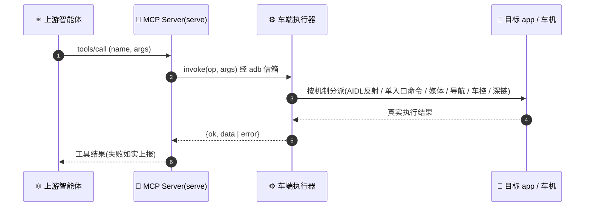

<div align="center">

# 🎛️ Code Agent Suite BRIDGE


**B**uilding **R**eal-device **I**nterfaces via **D**eterministic **G**ated **E**xecution


**English** · [简体中文](README.zh-CN.md)

</div>

BRIDGE 把车机 app 变成上游智能体可以真实调用的工具。输入一个 app（源码工程、多模块模板、APK、PRD 皆可），产出一套完整的 MCP 交付物：智能体能读懂的函数 schema、可直接运行的 MCP Server、车端分派表，以及每项能力真实有效的验证证据。

方法论放在 agent skill 里，重活全部由确定性的 Node CLI 完成，产物逐字节可复现。套件内部不做任何模型调用：判断由宿主 codeagent 给出，确定性由 CLI 保证。

## 🧠 How it works

四步主线，每一步都可复查：

```
输入任意 app(源码 / 模板 / APK / PRD / 行为观察)
  → bridge-analyze 产出 analysis.json(唯一真相源)
  → validate-analysis 确定性校验
  → serve 投影为 MCP 工具(上游智能体直接挂载)
  → invoke 上车真实执行
```

`analysis.json` 一份产物两处消费：serve 把 `id / description / params / scope` 投影成 MCP 工具面；车端执行器消费 `mechanism` 等机制字段（经 `registry.json` 分派）。

运行期一次工具调用的完整链路：



## 📦 Deliverables

一次成功运行产出可评审的交付包，而不是一个生成目录：

| 交付物 | 内容 | 给谁用 |
|---|---|---|
| `analysis.json` | 唯一真相源：全部能力（id、参数、机制字段、scope 归属、status、逐项交付说明） | 评审与再生成 |
| `function-schema.json` | 上游智能体函数定义（名称、描述、参数 schema、枚举） | 注入 Claude / Codex 等上游 |
| `registry.json` | 车端分派表（bind/call、wire 值、机制字段投影） | 车端执行器 |
| `prd-coverage.json`（有 PRD 时） | PRD 条目与能力的对照（已对应 / 缺口 / 超出） | 验收与评审 |
| 验证证据 | validate 结果、契约核对报告、真实 LLM 工具选择测试 | 审计 |

能力归属分级是交付的核心约定：`core`（本 app 自身设计目的的能力，交付主体）、`platform`（借道可达但归属平台或其他 app，默认不进本 app 交付）、`shared`（显式共享）。单一 app 的交付默认只含 core，避免跨团队产出重复。

## 🛡️ Why it's reliable

| 保证 | 如何做到 |
|---|---|
| **确定性产出** | CLI 零 app 字面量，任意机器逐字节可复现 |
| **先验证再交付** | validate-analysis 确定性校验 + 逐字契约核对 + 真实 LLM 工具选择测试（实测 97.8% 以上） |
| **状态诚实** | verified / probe / broken 各带证据；broken 默认不进 serve；设备不可达如实报错，绝不谎称成功 |
| **归属清晰** | core / platform 分级，单 app 交付纯净，跨 run 不重复 |
| **自包含** | CLI 经 skill 相对路径运行，首会话自动装依赖并构建；问题反馈通道内置（按需、高信噪比） |

## 📥 Install & run

**30-second first run (nothing to install)**，after `git clone`, just:

```bash
node viz/run.mjs --open
```

The viz page opens in your default browser (bundled sample data); click "▶ 端到端测试" and deps → build → config → gateway are all auto-bootstrapped (the page asks for the LLM key if missing). Zero manual steps. To analyze your own app, use the plugin flow below，bridge-analyze switches the visualization to your project automatically.

**Claude Code**

```bash
/plugin marketplace add https://github.com/MatCaviar/BRIDGE.git
/plugin install im-mcp-codeagent
```

First session start auto-installs `cli/` deps and builds `cli/dist` (idempotent).

Entry points，the `bridge-analyze` skill (analysis + validation) and the CLI (`serve` · `invoke`). For the voice E2E loop (gateway + cockpit), see the 2026-08 section below.

**Codex** reads the mirrored `.codex-plugin/plugin.json` (dual-end).

Typical run shape:

```bash
# 1. 分析(由宿主 codeagent 执行 bridge-analyze skill)产出 analysis.json, 然后:
node skills/bridge-analyze/validate-analysis.mjs <analysis.json>

# 2. 投影为 MCP Server(上游智能体挂载)
node cli/bin/mcp-pipeline.js serve --analysis <analysis.json> --device <车IP>:5555

# 3. 上车逐项实测复核
node cli/bin/mcp-pipeline.js invoke --op <tool_id> --device <车IP>:5555 [--args '<json>']
```

可视化与端到端测试随套件自带：`node viz/run.mjs` 单端口提供管线大屏与 cockpit（默认自动打开浏览器）。

## 🧩 Capability selection

Most apps expose far more capabilities than you want to MCP-ify. Selection happens **in the analysis itself** (no separate curate step):

- `capabilities[].status`，`verified` / `probe` / `broken`; serve skips `broken` by default (`--include-broken` to override)
- Drop or keep a capability by editing `analysis.json` and re-running `validate-analysis.mjs`，the file is the single source of truth, consumed by both `serve` (tool surface) and the car-side registry
- Callback-registration style methods (non-scalar binder params) are recorded as excluded with reasons, not silently dropped

## 🔄 Update (already installed)

When a new version ships, refresh and reload:

```text
/plugin marketplace update im-mcp-marketplace        # 1. refresh the catalog   (arg = marketplace name)
/plugin update im-mcp-codeagent@im-mcp-marketplace   # 2. pull the new version  (arg = plugin@marketplace)
/reload-plugins                                      # 3. activate it + re-run the build hook
```

> `/reload-plugins` (or a full `/exit` + relaunch) is **required**，until then the previous version stays live. The first session after reload re-runs the `SessionStart` build hook, which compiles `cli/dist` for the new version.

Verify the installed version:

```text
/plugin list
```

**Fallback**，if `/plugin update` reports "already latest" but the code didn't change (stale cache, or the version wasn't bumped):

```text
/plugin uninstall im-mcp-codeagent@im-mcp-marketplace
/plugin marketplace update im-mcp-marketplace
/plugin install im-mcp-codeagent@im-mcp-marketplace
/reload-plugins
```

## 📡 Real-device prerequisites

The generated server drives the car over an adb / file bridge. Before a real device responds:

1. **Colleague** builds + installs the car-side `RpcEngine.ts` and registers the `page://<app>/rpcagent` manifest page，both emitted under `car-side/`.
2. **`adb -host`** reachability to the device. The repo bundles a Windows adb (`tools/adb/adb.exe`); **macOS/Linux users need adb on PATH** (e.g. `brew install android-platform-tools`) or set `BRIDGE_ADB` to its path.
3. **ZebraAlfred** keep-alive (or equivalent)，otherwise the device sleeps and sendlink intermittently returns exit `-1`.

No device handy? Local verification always works: `mcp-pipeline verify --dir <server>` (install + tsc + tool responsiveness + bridge readiness).

## 🧱 Architecture

```
im-mcp-codeagent/
├── .claude-plugin/       Claude Code manifest + marketplace
├── .codex-plugin/        Codex manifest (dual-end mirror)
├── skills/               bridge-analyze (analyze → analysis.json, with validator)
├── hooks/                SessionStart → build cli (run-hook.cmd → session-init.sh)
├── cli/                  @im/mcp-pipeline-cli，deterministic Node
│   ├── src/commands/     serve · invoke
│   └── bin/mcp-pipeline.js
│   └── bin/mcp-pipeline.js

└── tools/adb/            bundled adb (self-contained; see LICENSE note)
```

The CLI runs via a **skill-base-relative path** (`${SKILL_DIR}/../../cli/bin/mcp-pipeline.js`)，self-contained, no PATH / global-link dependency.

## 🛠️ Develop

This section is for maintainers changing the plugin itself. Normal users running `/mcp-pipeline` do not need these commands.

```bash
cd framework && npm install
cd ../cli     && npm install && npx tsc     # build cli/dist (the real CLI loads dist/，rebuild after source edits)
cd ../cli     && npx vitest run             # full suite
node scripts/check-manifests.js             # claude / codex manifest drift guard
```


## 🆕 2026-08 新增: E2E 语音闭环 / bridge-analyze / 车端执行器

本仓库在 0.1.8 插件之上新增了落地产物（与插件 CLI 互补，CLI 不变）：

| 新增 | 位置 | 说明 |
|---|---|---|
| **bridge-analyze skill** | `skills/bridge-analyze/` | 分析 skill：任意 app(源码/PRD/APK/观察) → analysis.json（MCP serve 直接投影）。自带校验器 `validate-analysis.mjs`。 |
| **E2E 端到端测试** | `e2e/` | 语音→车 闭环：mcp-gateway 源码 + `bridge-analysis.json`(唯一真相源) + `bridge-serve-wrapper.mjs`(动态 IP 探测+断线自愈) + `bridge-ui-server.mjs`(App 型能力 ui_launch/ui_dump/ui_tap_text/geo_search) + `analysis-to-registry.mjs`(analysis→车端 registry 生成器)。38 工具面全绿实测。 |
| **车端执行器源码** | `bridge-executor/` | `com.immotors.bridge.executor`：execmd/media/mapnav/carcontrol/intent 五机制分派，手写 binder 契约（事务码声明序、typed-parcelable）。 |
| **工具脚本** | `tools/car_invoke.sh` `tools/probe_carcontrol.sh` + 车控 57 候选(handlers/candidates json) | 车端 invoke 助手 + 车控批量验证脚本 |
| **移交文档** | `handoff/` | 移交说明 + NEXT STEPS |
| **本地 ASR** | `asr/` | faster-whisper 中文识别(端口 8765) |

**E2E quick start** (two ways): **one-click**，open the viz page `http://localhost:8650/pipeline.html` and click "端到端测试"; gateway/deps/config are auto-bootstrapped (the page asks for the LLM key if missing, and points serve at the current analysis in project mode). **manual**，`cd e2e && npm install && QWEN_API_KEY=<key> npm run dashboard -- --config config-cockpit.yaml` (start `asr/asr-whisper-server.py` first), then open `http://localhost:3000/cockpit` and talk to the 🎤.

**单一校验入口**：analysis 规格由 `skills/bridge-analyze/validate-analysis.mjs` 校验；CLI 只负责 `serve` / `invoke`，避免旧 schema 与 E2E 规格漂移。

**工具规格流（唯一真相源）**：`e2e/bridge-analysis.json`(serve 字段+机制字段) → `node e2e/analysis-to-registry.mjs` 生成车端 registry → 校验 `node skills/bridge-analyze/validate-analysis.mjs e2e/bridge-analysis.json`。

凭据(DashScope key / 车签名 keystore)不随仓库分发。逆向素材(dex dump, 1.7GB)不入库, 位置见 `reverse/README.md`。

## 📜 License

MIT，see [LICENSE](LICENSE). `tools/adb/` bundles Google's adb under its own terms.

<div align="center">
<sub>Code Agent Suite BRIDGE，built by Tongji University &amp; IM · controllable code generation for the cockpit</sub>
</div>
