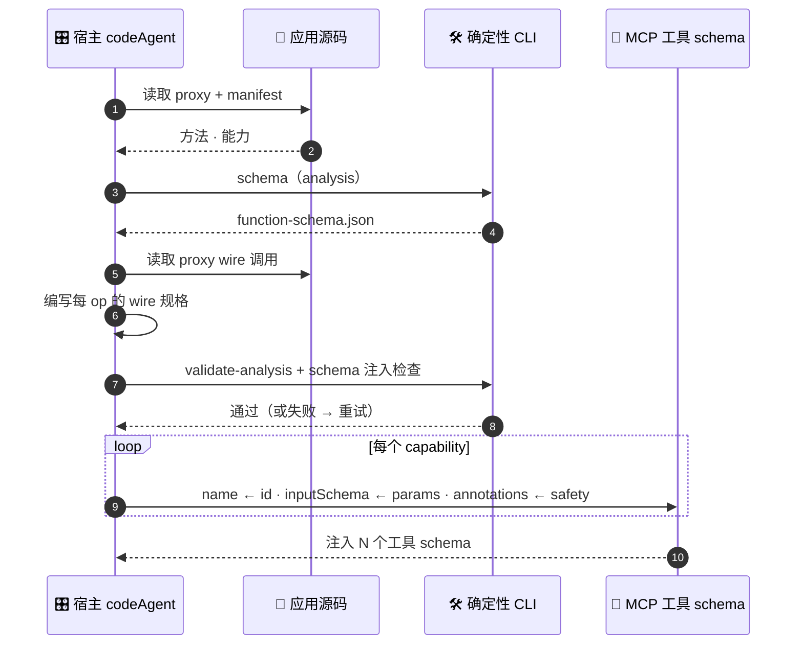
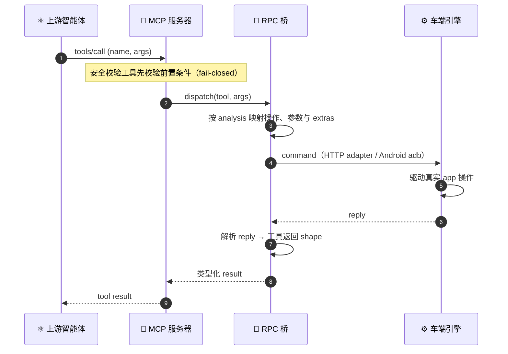

<div align="center">

# 🎛️ 代码智能体套件 BRIDGE

**B**uilding **R**eal-device **I**nterfaces via **D**eterministic **G**ated **E**xecution


</div>

BRIDGE 把车机等本地 app 变成上游智能体可以真实调用的工具。输入一个 app（源码工程、多模块模板、APK、PRD 皆可），产出一套完整的 MCP 交付物：函数 schema、MCP Server、车端分派表、验证证据。

## 🧠 工作原理

给定应用源码与 manifest，BRIDGE 产出一套 **MCP 套件**：面向智能体的函数 schema、可运行的 MCP Server、RPC wire 契约、车端桥接产物与验证证据。上游智能体可调用这些工具**真正驱动设备**，EQ、声场、Beosonic、卡拉 OK、车辆信号等，而非桩式 mock。函数 schema 接口面是供上游模型理解的首要产物；套件的其余部分使这些工具可执行、可审计。

下方 pipeline 给出各阶段；其后的图展示生成期各角色的分工。

**Pipeline**，每一步均为确定性 CLI 子命令或智能体 skill：

```
输入任意 app › bridge-analyze 产出 analysis.json › validate-analysis 校验 › serve 投影 MCP 工具 › invoke 上车执行 🟢
```

项目产物保存在 `.mcp-pipeline/<app>/`，可视化跟随本次分析与执行进度。

> `validate-analysis.mjs` 统一校验 analysis；`schema` 与 `serve` 共用同一份工具定义，`call` 通过相同契约校验并执行。

**生成过程。** 分工：宿主智能体提供判断（抽取、wire 编写），CLI 负责确定性执行（校验、schema 导出与调用）。每个能力映射到一个工具定义，`name ← id`、`inputSchema ← params`、`annotations ← safety`。



**运行期桥接。** 构建完成后，一次工具调用从上游智能体经生成出的 server 与确定性桥接流向真实设备，传输层可替换（`adb` / file / socket），wire 由项目的 analysis 与适配器配置构造，故桥接不含任何 app 字面量。



## 📦 交付物

一次成功的运行应产出一套可评审的交付 bundle，而非仅仅一个生成目录：

| 读者 | 交付物 | 位置 | 为何重要 |
|---|---|---|---|
| **上游智能体** | 函数 schema 接口面 | `schema` 导出的 `function-schema.json`，以及 MCP `tools/list` | 注入 Claude / Codex 的精确工具名、描述、输入 schema、安全 annotation 与可执行性标记。 |
| **MCP 宿主** | 可运行的 MCP Server | `cli/bin/mcp-pipeline.js serve --analysis <analysis.json>` | 托管工具的 stdio 服务器。 |
| **应用 / 设备集成方** | RPC wire 契约 | 项目的 `analysis.json`、`registry.json` 与应用适配目录 | 从每次工具调用到真实 app / 设备操作的可追溯桥接。 |
| **评审者** | 验证证据 | 项目验证记录、schema 注入结果、构建与调用测试输出 | 呈现 schema 合法性、wire 覆盖率、可构建性、工具发现与工具调用响应性的审计轨迹。 |

可直接由 analysis 产出面向上游智能体的 schema：

```bash
node cli/bin/mcp-pipeline.js schema --analysis <analysis.json> --out <function-schema.json>
```

支持每项能力一个函数，或通过 `action` 区分操作的统一 channel；上下文放在 `extras`，返回 `code / message / data / extras`，默认 `code: 0` 为业务成功。应用专属协议与适配代码保存在使用者自己的项目目录中。

完成的判定标准：

1. `function-schema.json` 与 MCP `tools/list` 对选中能力的名称、参数和动作分支保持一致。
2. 每个工具都有具体的描述、具体的输入 schema、正确的枚举值与安全 annotation。
3. `validate-analysis.mjs`、schema 注入检查、构建与对应运行环境的测试通过。
4. 调用测试覆盖业务工具及其返回结果。
5. 项目适配器与可选 Android registry 可直接交付给设备端同事。

完整契约见 [`docs/tool-contract.md`](docs/tool-contract.md)。

## 🛡️ 为何可靠

| 保障 | 如何落实 |
|---|---|
| **确定性输出** | 生成器不含任何 app 字面量，任意 app、任意机器，逐字节可复现。 |
| **构建前验证** | `validate-analysis.mjs` 校验能力与机制字段，schema 注入检查核对静态文件、MCP 与上游模型格式。 |
| **fail-closed 安全** | `p_gear_required` 工具在未验证 P 档时即被拦截；退化输入（空 / 不匹配）报错而非空洞放行。 |
| **归属清晰** | 通过 `scope` 与 `deliveryScopes` 选择交付能力，默认只含 core；broken 默认不进入工具面。 |
| **真实桥接** | 项目 HTTP adapter 或通用 Android 执行器连接宿主与目标应用，执行结果按业务契约返回。 |
| **自包含** | CLI 经 skill-base 相对路径运行；`cli/` 依赖在首次会话自动安装并构建。 |

## 📥 安装与运行

**首次体验**：安装 Node.js 并 `git clone` 本仓库后运行

```bash
node viz/run.mjs --open
```

可视化页在默认浏览器自动打开（内置仓库样例数据）；点击「▶ 端到端测试」即自动安装依赖 → 构建 → 生成配置 → 拉起网关（缺 LLM key 时页面会询问），调用内置 HTTP 仿真工具前，在另一终端运行 `node e2e/demo-device.mjs`。对任意 app 做正式分析请走下方插件流程（bridge-analyze skill 会自动把可视化切到该项目）。

**Claude Code**

```bash
/plugin marketplace add https://github.com/MatCaviar/BRIDGE.git
/plugin install im-mcp-codeagent
```

首次会话启动会自动安装 `cli/` 并构建 `cli/dist`（幂等）。随后让宿主智能体执行一次分析：

```
使用 bridge-analyze 分析 ./path/to/your-app，产出函数 schema 与接入配置。
```

入口为 `bridge-analyze` skill；CLI 提供 `schema` · `serve` · `call` · `invoke`。

**Codex** 读取镜像的 `.codex-plugin/plugin.json`（双端）。

典型运行形态：

```bash
# analysis 校验 / 确定性生成
node skills/bridge-analyze/validate-analysis.mjs <analysis.json>
node cli/bin/mcp-pipeline.js schema --analysis <analysis.json> --out <function-schema.json>

# 上游智能体挂载与业务调用（HTTP 模式省略 --device）
node cli/bin/mcp-pipeline.js serve --analysis <analysis.json> --device <serial>
node cli/bin/mcp-pipeline.js call --analysis <analysis.json> --op <tool_id> --device <serial> [--args '<json>']

# 对照静态产物、MCP tools/list 与上游模型格式
node e2e/schema-injection-smoke.mjs --analysis <analysis.json>
```

普通插件用户通常经 `bridge-analyze` 进入；低层 CLI 命令一并列出，使生成出的交付 bundle 可审计、可复现。

## 🧩 能力筛选

多数 app 暴露的能力远多于实际需要 MCP 化的数目。安装并完成首轮分析后，可在 `analysis.json` 中选定交付范围，用户的取舍优先级最高。

- `scope` 区分 `core` / `shared` / `platform`，通过 `deliveryScopes` 选择，默认只含 core。
- `status` 区分 `verified` / `probe` / `broken`；broken 默认不进入 serve，`--include-broken` 仅用于查看。
- 调整能力后重新校验，并同步生成 function schema、registry 与可视化；媒体工具同样按需选择。

## 🔄 更新（已安装）

新版本发布时，刷新并重载：

```text
/plugin marketplace update im-mcp-marketplace        # 1. 刷新目录   （参数 = marketplace 名）
/plugin update im-mcp-codeagent@im-mcp-marketplace   # 2. 拉取新版本（参数 = plugin@marketplace）
/reload-plugins                                      # 3. 激活并重跑 build hook
```

> **必须**执行 `/reload-plugins`（或完整 `/exit` 后重启），在此之前旧版本仍生效。重载后首次会话会重跑 `SessionStart` build hook，为新版本编译 `cli/dist`。

核对已安装版本：

```text
/plugin list
```

**兜底**，若 `/plugin update` 报 "already latest" 但代码未变（缓存过期或版本未 bump）：

```text
/plugin uninstall im-mcp-codeagent@im-mcp-marketplace
/plugin marketplace update im-mcp-marketplace
/plugin install im-mcp-codeagent@im-mcp-marketplace
/reload-plugins
```

## 📡 真机前置条件

生成的 server 经 adb / file 桥驱动车机。真实设备响应前需：

1. 构建并安装[通用 Android 执行器](bridge-executor/README.md)，部署项目自己的 `registry.json`，按需提供目标接口源码。
2. 对设备的 **`adb -host`** 可达性。仓库仅内置 Windows 版 adb（`tools/adb/adb.exe`）；**macOS/Linux 需自备 adb 并加入 PATH**（如 `brew install android-platform-tools`），或用 `BRIDGE_ADB` 指定路径。
3. 保持设备唤醒，配置目标所需权限与 Android 用户（`--user`，默认 `0`）；Android 信箱通道需要特权 shell 访问。

手头没有设备？可运行[本地仿真与 schema 注入测试](e2e/README.md)。HTTP 接入在 analysis 中配置项目适配端地址，无需 Android 执行器。

## 🧱 架构

```
im-mcp-codeagent/
├── .claude-plugin/       Claude Code manifest + marketplace
├── .codex-plugin/        Codex manifest（双端镜像）
├── skills/               bridge-analyze（分析方法与校验入口）
├── hooks/                SessionStart → CLI 构建（session-init.mjs）
├── cli/                  @im/mcp-pipeline-cli，确定性 Node
│   ├── src/commands/     schema · serve · call · invoke
│   └── bin/mcp-pipeline.js
├── contract/             共用 analysis 校验
├── bridge-executor/      通用 Android 执行器
├── e2e/                  网关、仿真与集成测试
└── tools/adb/            内嵌 adb（自包含；见 LICENSE 注）
```

CLI 经 **skill-base 相对路径**（`${SKILL_DIR}/../../cli/bin/mcp-pipeline.js`）运行，自包含，不依赖 PATH / 全局链接。

## 🛠️ 开发

本节面向修改插件本身的维护者。普通使用 `bridge-analyze` 的用户无需这些命令。

```bash
npm --prefix cli ci
npm --prefix cli run build                 # 构建 cli/dist，源码改动后须重建
npm --prefix cli test                      # CLI 测试
npm --prefix e2e ci
npm --prefix e2e test                      # 网关集成测试
node scripts/check-manifests.js             # claude / codex manifest 漂移守卫
```

## 📜 许可证

MIT，见 [LICENSE](LICENSE)。`tools/adb/` 内嵌 Google 的 adb，遵循其自身条款。

<div align="center">
<sub>代码智能体套件 BRIDGE，由同济大学 & IM 构建 · 面向智能座舱的可控代码生成</sub>
</div>


## 🆕 2026-08 新增: E2E 语音闭环 / bridge-analyze / 车端执行器

本仓库在 0.1.8 插件之上新增以下产物，并随套件持续更新：

| 新增 | 位置 | 说明 |
|---|---|---|
| **bridge-analyze skill** | `skills/bridge-analyze/` | 面向现 E2E serve 规格的重构版分析 skill（任意 app → analysis.json，自带校验器）。导出 function schema，并衔接当前 E2E 流程。 |
| **E2E 端到端测试** | `e2e/` | 语音→车闭环：mcp-gateway + analysis(唯一真相源) + wrapper(动态IP自愈) + bridge-ui(App型能力) + registry 生成器。工具面由本次 analysis 的选中能力与调用模式决定。 |
| **车端执行器源码** | `bridge-executor/` | aidl/execmd/media/intent 通用机制，目标接口与 Binder 参数由项目配置。 |
| **工具脚本与接入文档** | `tools/`、`docs/tool-contract.md`、`examples/` | car_invoke 兼容入口、公共契约与接入样例。 |

E2E 快速开始（两种）：**一键**，打开可视化页 `http://localhost:8650/pipeline.html` 点「端到端测试」，网关/依赖/配置自动拉起（缺 LLM key 时页面询问，项目模式自动指向本次分析产物）；**手动**，语音输入按需配置自己的 ASR 服务，随后 `cd e2e && npm install && QWEN_API_KEY=<key> npm run dashboard -- --config config-cockpit.yaml`，浏览器开 `http://localhost:3000/cockpit`。
凭据与逆向素材不随仓库分发，应用专属素材与适配保存在使用者自己的项目中。


## 📮 问题反馈（各团队使用 BRIDGE 时）

执行中遇到**真正值得讨论优化的问题**（机制缺陷/误导文档/通用能力缺口/改进构想），codeagent 可按需记录到 `<产物目录>/feedback/`（标准 JSON，自带环境上下文），按需使用、宁缺毋滥，已知限制与可自行绕过的小问题不必上报。如记录了反馈，经用户确认后可统一上报：

```bash
node skills/bridge-analyze/feedback.mjs submit
```

- **自动建 Issue**：设置环境变量 `BRIDGE_FEEDBACK_TOKEN`（GitHub 细粒度 PAT，仅授予本仓库 `Issues: Read and write`，申请后由 BRIDGE 团队分发/自行创建）→ 反馈自动进入 `MatCaviar/BRIDGE` Issues，带 `[feedback][类型][严重度]` 标签，团队统一处理；
- **无凭证降级**：自动打包 `feedback-bundle-*.md`，把它发给 BRIDGE 团队即可；
- 手动记录：`feedback.mjs new --type bug --severity major --title … --detail …`（详见 `--help`）。
