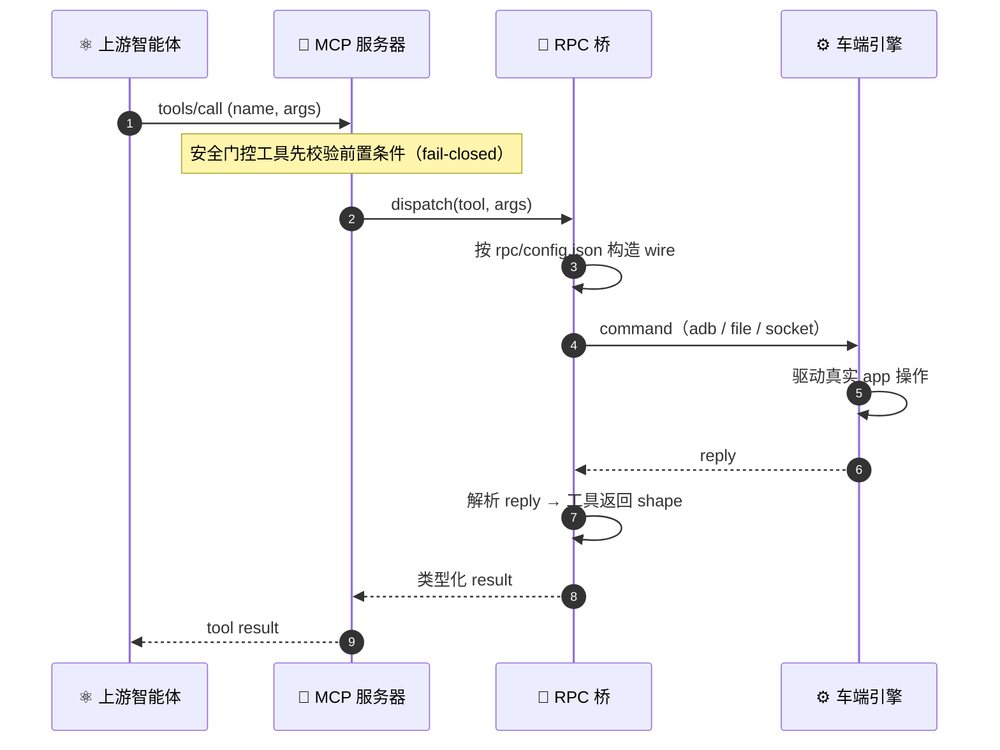

<div align="center">

# 🎛️ 代码智能体套件 BRIDGE


**B**uilding **R**eal-device **I**nterfaces via **D**eterministic **G**ated **E**xecution
（基于确定性门控执行构建真机接口）

`analyze` › `curate` › `scaffold` › `generate` › `gates` › `build`


[English](README.md) · **简体中文**

</div>

---

一款 Claude Code / Codex 插件——**BRIDGE**（*Building Real-device Interfaces via Deterministic Gated Execution*，基于确定性门控执行构建真机接口）：由**智能体驱动的 skill** 承载方法论，**确定性** Node CLI 承担繁重计算，宿主智能体驱动每一步。**插件内部不含任何模型调用**——所有判断皆由宿主智能体提供，每个生成产物皆逐字节可复现。

## 🧠 工作原理

给定应用源码与 manifest，BRIDGE 产出一套 **MCP 套件**：面向智能体的函数 schema、可运行的 MCP Server、RPC wire 契约、车端桥接产物与验证证据。上游智能体可调用这些工具**真正驱动设备**——EQ、声场、Beosonic、卡拉 OK、车辆信号等——而非桩式 mock。函数 schema 接口面是供上游模型理解的首要产物；套件的其余部分使这些工具可执行、可审计。

下方 pipeline 给出各阶段；其后的图展示生成期各角色的分工。

**Pipeline**——每一步均为确定性 CLI 子命令或智能体 skill：

```
validate › analyze › [curate] › scaffold › generate › test › build › register › verify 🟢
  (CLI)     (skill)   (skill)    (CLI)    (skill+gates) (CLI)  (CLI)   (CLI)     (CLI)
```

进度持久化于 `.mcp-pipeline/<app>/state.json`，支持断点续跑——`--from`、`--only`、`--step`、`--batch`。

> 两道闸门（`validate_config` + `wire_check`）是 `generate` 的内联子步骤，二者均通过后 pipeline 才会推进（失败即重试）。`[curate]` 为可选。

**生成过程。** 分工：宿主智能体提供判断（抽取、wire 编写），CLI 负责确定性执行（scaffold、闸门）。每个能力映射到一个工具定义——`name ← id`、`inputSchema ← params`、`annotations ← safety`。


**运行期桥接。** 构建完成后，一次工具调用从上游智能体经生成出的 server 与确定性桥接流向真实设备——传输层可替换（`adb` / file / socket），wire 纯由 `rpc/config.json` 构造，故桥接不含任何 app 字面量。



## 📦 交付物

一次成功的运行应产出一套可评审的交付 bundle，而非仅仅一个生成目录：

| 读者 | 交付物 | 位置 | 为何重要 |
|---|---|---|---|
| **上游智能体** | 函数 schema 接口面 | `schema_preview` 产出的 `tools-schema.json`，以及生成 server 内的 `src/tools/schema.ts` | 注入 Claude / Codex 的精确工具名、描述、输入 schema、安全 annotation 与可执行性标记。 |
| **MCP 宿主** | 可运行的 MCP Server | 生成 server 目录、构建后的 `dist/index.js` 与 `conf/config.yaml` | 托管工具的 stdio 服务器。 |
| **应用 / 设备集成方** | RPC wire 契约 | `rpc/config.json`、`src/rpc/*` 与 `car-side/` | 从每次工具调用到真实 app / 设备操作的可追溯桥接。 |
| **评审者** | 验证证据 | `.mcp-pipeline/<app>/state.json`、`.mcp-pipeline/test-results.json`、闸门输出、构建输出、verify 输出 | 呈现 schema 合法性、wire 覆盖率、可构建性、工具发现与工具调用响应性的审计轨迹。 |

可直接由 analysis（及可选的 wire 状态）产出面向上游智能体的 schema：

```bash
mcp-pipeline schema_preview <analysis.json> [<rpc/config.json>] --output tools-schema.json
```

`rpc/config.json` 可在 `_deferred` 中标记有意不接线的工具；这些工具以 `executable:false` 呈现，而非静默伪装可工作。

完成的判定标准：

1. `tools-schema.json` 精确地、各一次地暴露每个选中能力。
2. 每个工具都有具体的描述、具体的输入 schema、正确的枚举值与安全 annotation。
3. `validate`、`validate_config`、`wire_check`、`test`、`build`、`verify` 全部通过。
4. `verify` 证明的是业务工具调用，而非仅 `health_check`。
5. `car-side/` 可直接交付给设备端同事，无需其逆向 pipeline 内部。

完整契约见 [`docs/DELIVERABLE_CONTRACT.md`](docs/DELIVERABLE_CONTRACT.md)。

## 🛡️ 为何可靠

| 保障 | 如何落实 |
|---|---|
| **确定性输出** | 生成器不含任何 app 字面量——任意 app、任意机器，逐字节可复现。 |
| **构建前验证** | 两道 fail-closed 闸门——`validate_config`（schema + 覆盖率 + 可调度）与 `wire_check`（proxy wire 格式匹配）——必须通过宿主唯一的判断产物 `rpc/config.json`。 |
| **fail-closed 安全** | `p_gear_required` 工具在未验证 P 档时即被拦截；退化输入（空 / 不匹配）报错而非空洞放行。 |
| **诚实的 selection** | `--selection` 遇缺失文件、未知 id 或空列表时**显式报错**，而非静默地多生成或少生成。 |
| **真实桥接，无外部网络** | 车端 RPC 引擎（交付给同事）经 adb / file / sendlink 桥接 宿主 → 设备。 |
| **自包含** | CLI 经 skill-base 相对路径运行；`framework/` + `cli/` 依赖在首次会话自动安装并构建。 |

## 📥 安装与运行

**Claude Code**

```bash
/plugin marketplace add https://github.com/MatCaviar/im-mcp-codeagent.git
/plugin install im-mcp-codeagent
```

首次会话启动会自动安装 `framework/` + `cli/` 并构建 `cli/dist`（幂等）。随后启动一次 pipeline 运行：

```
/mcp-pipeline ./path/to/your-app
```

入口——`/mcp-pipeline` · `/mcp-verify <dir>` · `/mcp-help`。

**Codex** 读取镜像的 `.codex-plugin/plugin.json`（双端）。

典型运行形态：

```bash
# 确定性检查 / 生成
mcp-pipeline validate <analysis.json>
mcp-pipeline scaffold <analysis.json> --output <server>

# 宿主智能体判断产物 + 确定性闸门
mcp-pipeline validate_config <server>/rpc/config.json --analysis <analysis.json>
mcp-pipeline wire_check <server>/rpc/config.json --proxy <path/to/Proxy.ts>

# 上游智能体 schema 与运行期证据
mcp-pipeline schema_preview <analysis.json> <server>/rpc/config.json --output <server>/tools-schema.json
mcp-pipeline test --dir <server>
mcp-pipeline build --dir <server>
mcp-pipeline verify --dir <server>
```

普通插件用户通常经 `/mcp-pipeline` 进入；低层 CLI 命令一并列出，使生成出的交付 bundle 可审计、可复现。

## 🧩 能力筛选

多数 app 暴露的能力远多于实际需要 MCP 化的数目。安装并完成首轮 `analyze` 后，可通过 **curate** 选定子集——用户的取舍优先级最高。

```bash
# 1. 确定性地枚举候选（不写任何文件）
mcp-pipeline curate <analysis.json> [--prd <prd.md>]

# 2. /mcp-curate 提议子集，由用户拍板 → 写 selection.json
# 3. scaffold 仅生成被选中的能力
mcp-pipeline scaffold <analysis.json> --output <dir> --selection .mcp-pipeline/<app>/selection.json
```

`selection.json = { "selected": ["<cap.id>", …] }`。可随时重选——generate 层会重新生成，而 `conf/config.yaml` 与 `rpc/config.json` 予以保留。

## 🔄 更新（已安装）

新版本发布时，刷新并重载：

```text
/plugin marketplace update im-mcp-marketplace        # 1. 刷新目录   （参数 = marketplace 名）
/plugin update im-mcp-codeagent@im-mcp-marketplace   # 2. 拉取新版本（参数 = plugin@marketplace）
/reload-plugins                                      # 3. 激活并重跑 build hook
```

> **必须**执行 `/reload-plugins`（或完整 `/exit` 后重启）——在此之前旧版本仍生效。重载后首次会话会重跑 `SessionStart` build hook，为新版本编译 `cli/dist`。

核对已安装版本：

```text
/plugin list
```

**兜底**——若 `/plugin update` 报 "already latest" 但代码未变（缓存过期或版本未 bump）：

```text
/plugin uninstall im-mcp-codeagent@im-mcp-marketplace
/plugin marketplace update im-mcp-marketplace
/plugin install im-mcp-codeagent@im-mcp-marketplace
/reload-plugins
```

## 📡 真机前置条件

生成的 server 经 adb / file 桥驱动车机。真实设备响应前需：

1. **同事**构建并安装车端 `RpcEngine.ts`，并注册 `page://<app>.yunos.com/rpcagent` manifest page——二者皆产出于 `car-side/`。
2. 对 YunOS 设备的 **`adb -host`** 可达性。
3. **ZebraAlfred** 保活（或等价手段）——否则设备休眠，sendlink 会间歇性返回 exit `-1`。

手头没有设备？本地验证始终可用：`mcp-pipeline verify --dir <server>`（安装 + tsc + 工具响应性 + 桥就绪性）。

## 🧱 架构

```
im-mcp-codeagent/
├── .claude-plugin/       Claude Code manifest + marketplace
├── .codex-plugin/        Codex manifest（双端镜像）
├── skills/               mcp-analyze · mcp-curate · mcp-generate · mcp-pipeline · mcp-test（方法论，无模型调用）
├── commands/             /mcp-pipeline · /mcp-verify · /mcp-help
├── hooks/                SessionStart → 多语言构建（run-hook.cmd → session-init.sh）
├── cli/                  @im/mcp-pipeline-cli——确定性 Node
│   ├── src/generators/   tool-schema · rpc-bridge · car-rpc-engine · …
│   ├── assets/           car-rpc-engine.ts.template（内嵌、去硬编码）
│   └── bin/mcp-pipeline.js
├── framework/            @im/mcp-server-framework（共享 dispatch 核心：constructDbusCall / …）
├── tools/adb/            内嵌 adb（自包含；见 LICENSE 注）
└── schema/               analysis.schema.json + fixtures
```

CLI 经 **skill-base 相对路径**（`${SKILL_DIR}/../../cli/bin/mcp-pipeline.js`）运行——自包含，不依赖 PATH / 全局链接。

## 🛠️ 开发

本节面向修改插件本身的维护者。普通运行 `/mcp-pipeline` 的用户无需这些命令。

```bash
cd framework && npm install
cd ../cli     && npm install && npx tsc     # 构建 cli/dist（真实 CLI 加载 dist/——源码改动后须重建）
cd ../cli     && npx vitest run             # 全套测试
node scripts/check-manifests.js             # claude / codex manifest 漂移守卫
```

## 📜 许可证

MIT——见 [LICENSE](LICENSE)。`tools/adb/` 内嵌 Google 的 adb，遵循其自身条款。

<div align="center">
<sub>CodeAgent @ MCP · BRIDGE——由同济大学 & IM 构建 · 面向 YunOS 智能座舱的可控 MCP</sub>
</div>
